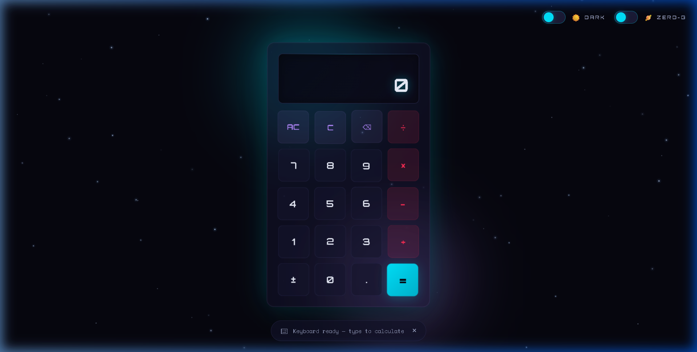
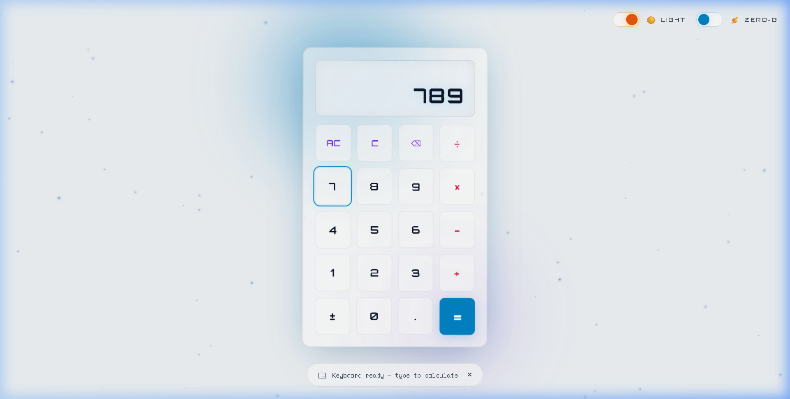

# Zero-G Anti-Gravity Calculator 🪐

A fully functional, sci-fi inspired arithmetic calculator featuring a "weightless" interface. The experience is designed to feel like operating a device in zero gravity: elements drift subtly, interactions have buoyant feedback, and completed values visually "float away" into space.

## Features

- **Zero-G Physics:** Elements feature a subtle drifting animation, and buttons smoothly repel away from the cursor when hovered.
- **Float-Away Output:** Completed calculations or cleared entries animate upwards, fading out like they're floating into the cosmos.
- **Ambient Stardust:** A subtle, battery-friendly canvas background with twinkling, slowly drifting stars.
- **Dual Themes:** Toggle smoothly between a deep-space **Dark Theme** and a pleasant, airy **Light Theme**.
- **Gravity Switch:** Toggle gravity ON to lock elements into a rigid grid, or OFF to return to floating zero-G behavior.
- **Keyboard Support:** Full keyboard mapping for rapid calculations without using the mouse.
- **Immediate Execution:** Uses a classic pocket-calculator chaining evaluation model (e.g., `12 ÷ 3 + 4` executes sequentially).

## Screenshots

### Dark Theme

### Light Theme

## Evaluation Model

This calculator uses an **Immediate Execution** evaluation model. This mimics traditional pocket calculators where operations are executed immediately upon entering the next operator.
For example, typing `5 + 5 × 2 =` will first resolve `5 + 5` to `10`, then multiply by `2` to return `20` (ignoring standard order of operations).

## Controls & Usage

- **Mouse / Touch:** Click or tap any button to input values.
- **Gravity Toggle:** Located in the top right, it snaps floating buttons back into place when activated.
- **Theme Toggle:** Switch between Dark and Light mode without breaking animations.

**Keyboard Mapping:**
- `0` - `9`: Digits
- `.`: Decimal Point
- `+`, `-`, `*`, `/`: Operators
- `Enter` / `=`: Equals
- `Escape`: All Clear (AC)
- `Backspace`: Delete the last entered digit

## Tech Stack
- Vanilla **HTML5**, **CSS3**, and **JavaScript**
- No external libraries or dependencies

## Installation
Since this project uses plain HTML/CSS/JS, simply open `index.html` in any modern web browser to run the calculator locally.
